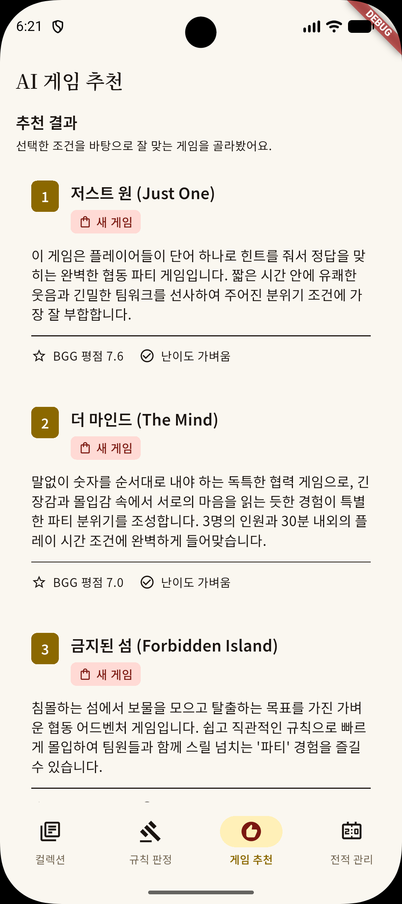

# BGMate — 보드게임 동반자 앱

> Android (Jetpack Compose) + Flutter 크로스플랫폼
> AI 규칙 판정 · AI 게임 추천 · 컬렉션 관리 · 플레이 기록 · 판매 추천

## 스크린샷

| 오늘 플레이 | 게임 컬렉션 | AI 규칙 판정관 | 판매 추천 |
|:---:|:---:|:---:|:---:|
|  |  |  |  |

## 핵심 기능

| 기능 | 설명 |
|---|---|
| 🏠 **오늘 플레이 홈** | 최근 플레이 게임과 바로 시작할 기능을 한 화면에서 제공 |
| 📚 **게임 컬렉션** | BGG XML API 검색, 게임 상세 enrichment, 컬렉션 등록·관리 |
| 🤖 **AI 규칙 판정관** | 게임 규칙 분쟁을 Gemini SSE 스트리밍으로 판정하고 이력 저장 |
| 🎯 **AI 게임 추천** | 인원수·시간·분위기와 보유 컬렉션을 기준으로 게임 추천 |
| 📊 **점수 트래커** | 플레이어별 점수·순위 입력과 세션 자동 저장 |
| 🔄 **BGG 동기화** | BGG 컬렉션과 플레이 기록을 가져와 플레이 통계에 반영 |
| 💰 **판매 추천** | 플레이 빈도·미플레이 기간·본판/확장 필터와 중고 시세 조회 |

## 최신 변경사항

- 홈을 기본 진입점인 `오늘 플레이`로 변경하고 최근 게임·최근 전적·판매 후보를 통합했습니다.
- 컬렉션, 판매 추천, 판정, 추천, 전적, 설정을 반응형 NavigationBar/NavigationRail로 제공합니다.
- BGG username을 설정에서 연결하면 컬렉션과 플레이 기록을 동기화하고, 불완전한 기록은 통계에서 제외합니다.
- 판매 추천에 본판/확장 필터, 최소 플레이 횟수, 미플레이 기간, 후보 수 필터와 중고가 조회를 추가했습니다.
- 컬렉션 상세·게임 검색·플레이 시작·판정 화면 사이의 라우팅과 화면 상태 보존을 정리했습니다.
- 중고가는 Flutter에서 Boardlife를 직접 조회하지 않고 `bgcut`의 읽기 전용 wrapper API를 사용합니다.
- 홈·컬렉션·판정·추천·판매 추천과 BGG/중고가 데이터 경계에 대한 단위 및 위젯 테스트를 확장했습니다.

## 아키텍처

Android와 Flutter 모두 Clean Architecture 3계층 구조를 따릅니다.

```
Presentation → Domain → Data
```

### Android

| 레이어 | 기술 |
|---|---|
| Presentation | Jetpack Compose · MVVM · StateFlow |
| Domain | Kotlin data class · Repository interface |
| Data | Room · Retrofit · OkHttp · LlmClient |
| DI | Hilt |

### Flutter

| 레이어 | 기술 |
|---|---|
| Presentation | Flutter Widget · Riverpod 3 · go_router |
| Domain | Freezed sealed class · Repository interface |
| Data | Drift/SQLite · Dio · BGG XML API · Gemini SSE |
| DI | Riverpod Provider |

## Flutter 프로젝트 구조

```
flutter/
├── lib/
│   ├── data/
│   │   ├── local/          # Drift DB, DAO, 설정, 플레이 통계
│   │   ├── remote/         # BGG 검색·동기화·플레이, 중고가, Gemini
│   │   └── repository/     # Domain repository 구현체
│   ├── domain/             # BoardGame, Session, BGG 통계 등 Freezed 모델
│   ├── di/                 # DB·원격·repository Provider
│   ├── routing/            # AppRoutes와 화면 위치 생성기
│   └── presentation/
│       ├── home/           # 오늘 플레이 홈
│       ├── collection/     # 컬렉션·검색·상세·중고가
│       ├── sale/           # 판매 후보 필터·추천
│       ├── rule_judge/     # AI 규칙 판정
│       ├── recommend/      # AI 게임 추천
│       ├── session_tracker/ # 점수 입력
│       ├── session_history/ # 앱 전적·BGG 플레이 통계
│       └── settings/       # BGG 계정 연결·동기화
├── assets/prompts/         # AI 시스템 프롬프트
└── test/                   # 데이터·provider·화면 테스트
```

Drift schema version은 6이며 플레이 통계, 앱 설정, BGG play ID 마이그레이션을 포함합니다.

## 기술 스택

```
Dart · Flutter 3.x · Material 3
Riverpod 3 · go_router · freezed · drift
Dio · cached_network_image · url_launcher
Gemini 2.5 Flash (SSE 스트리밍) · BGG XML API v2
```

## 실행 방법

```bash
cd flutter
cp dart_define.json.example dart_define.json
```

`dart_define.json`은 Git에서 제외되며 다음 값을 필요에 따라 입력합니다.

```json
{
  "BGG_API_TOKEN": "your_token_here",
  "GEMINI_API_KEY": "your_key_here",
  "BGMATE_USED_PRICE_API_BASE_URL": "https://your-bgcut-domain.example"
}
```

```bash
# 코드 생성
./tool/flutter_with_env.sh pub run build_runner build --delete-conflicting-outputs

# 실행·분석·테스트
./tool/flutter_with_env.sh run
./tool/flutter_with_env.sh analyze
./tool/flutter_with_env.sh test
```

`BGMATE_USED_PRICE_API_BASE_URL`은 `GET /api/bgmate/used-price`를 제공하는 bgcut wrapper 주소입니다. 설정하지 않으면 중고가 조회만 비활성화됩니다.

## 테스트

Flutter 테스트는 `ProviderContainer`와 fake/mock repository를 사용해 외부 API와 DB를 격리합니다. 주요 검증 범위는 다음과 같습니다.

- BGG XML 검색·컬렉션·플레이 응답 파싱 및 오류 처리
- Drift 매핑·마이그레이션·플레이 통계
- 중고가 wrapper URI와 컬렉션 상세/판매 추천 provider
- 홈·컬렉션·판정·추천·판매 추천·설정 화면 상태
- 추천/판정 Gemini 503·429 재시도와 오류 상태

## 라이선스

MIT
