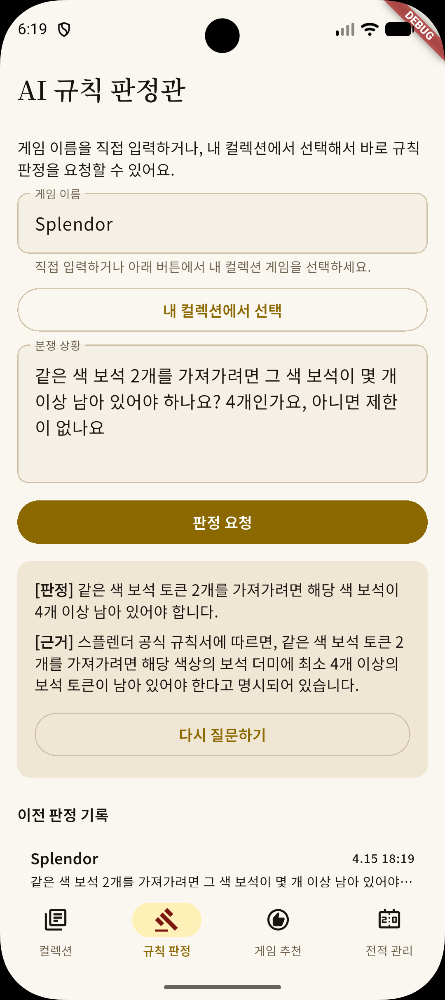
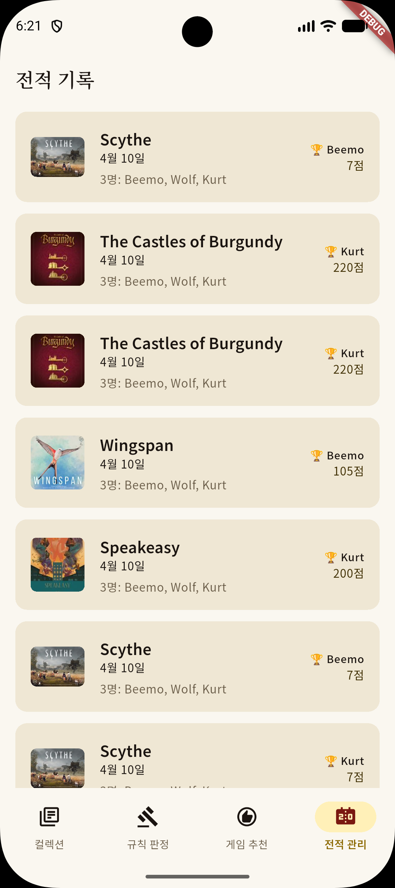
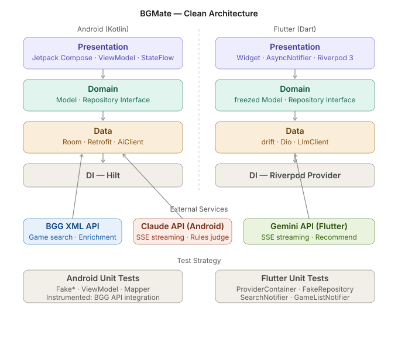

# BGMate — 보드게임 동반자 앱

> **Android (Jetpack Compose) + Flutter 크로스플랫폼**  
> AI 규칙 판정 · AI 게임 추천 · 점수 트래커 · 게임 컬렉션 관리

<!-- [](https://play.google.com/store/apps/details?id=com.kurt.bgmate) -->
<!-- [](https://flutter.dev) -->
<!-- [](https://play.google.com/store/apps/details?id=com.kurt.bgmate) -->

---

## 스크린샷

### Flutter

|                                       게임 컬렉션                                        |                                        AI 규칙 판정관                                        |                                         점수 트래커                                          |                                         AI 게임 추천                                          |
|:-----------------------------------------------------------------------------------:|:---------------------------------------------------------------------------------------:|:---------------------------------------------------------------------------------------:|:-----------------------------------------------------------------------------------------:|
|  |  |  |  |

---

## 핵심 기능

| 기능 | 설명 |
|---|---|
| 🤖 **AI 규칙 판정관** | 게임 규칙 분쟁 상황을 입력하면 AI가 해당 게임 규칙 기반으로 판정. SSE 스트리밍으로 실시간 응답 |
| 🎯 **AI 게임 추천** | 인원수 · 시간 · 분위기 입력 시 보유 컬렉션 또는 전체 게임 중 AI 추천 |
| 📊 **점수 트래커** | 게임별 커스텀 점수판, 순위 배지, 세션 자동 저장 |
| 📚 **게임 컬렉션** | BGG XML API 연동 게임 검색, 컬렉션 등록 · 관리, 상세 정보 enrichment |

---

## 아키텍처



Android와 Flutter 모두 **Clean Architecture** 3계층 구조를 따릅니다. 의존성은 단방향으로 흐릅니다.

```
Presentation → Domain → Data
```

### Android

| 레이어 | 기술 |
|---|---|
| Presentation | Jetpack Compose · MVVM · StateFlow · collectAsStateWithLifecycle |
| Domain | 순수 Kotlin data class · Repository interface |
| Data | Room (로컬) · Retrofit + OkHttp (BGG API) · LlmClient 추상화 |
| DI | Hilt |

### Flutter

| 레이어 | 기술 |
|---|---|
| Presentation | Widget · AsyncNotifier · Riverpod 3 · go_router |
| Domain | freezed sealed class · Repository interface |
| Data | drift (로컬) · Dio (BGG API) · LlmClient 추상화 |
| DI | Riverpod Provider |

---

## 기술 스택

### Android

```
Kotlin · Jetpack Compose · Material3
MVVM · Clean Architecture · Hilt
Room · Retrofit2 · OkHttp · Coil3
Coroutines · Flow · StateFlow
Gemini API (SSE 스트리밍, Claude 롤백 가능)
BGG XML API v2
```

### Flutter

```
Dart · Flutter 3.x · Material3
Riverpod 3 · go_router · freezed
drift (SQLite) · Dio · cached_network_image
Gemini API (SSE 스트리밍)
BGG XML API v2
```

---

## 주요 설계 결정

### LlmClient 인터페이스 추상화

AI 제공자를 인터페이스로 격리해 코드 변경 없이 교체 가능한 구조를 설계했습니다.

- Android: `LlmClient` (Gemini SSE 스트리밍 기본 활성 · Claude 롤백 가능)
- Flutter: `LlmClient` (Gemini 2.5 Flash SSE 스트리밍 · 503/429 지수 백오프 재시도)

### 시스템 프롬프트 assets 분리

AI 프롬프트를 코드가 아닌 assets 파일로 관리합니다. 코드 수정 없이 프롬프트만 교체 가능한 구조입니다.

```
Android: assets/
├── rule_judge_prompt.txt
├── recommend_prompt_owned.txt
└── recommend_prompt_all.txt

Flutter: assets/prompts/
├── rule_judge_prompt.txt
├── recommend_prompt_owned.txt
└── recommend_prompt_all.txt
```

### PlayerEntity 신원 테이블 분리

점수 기록에서 플레이어 이름 중복을 DB 레벨에서 관리합니다. 이름 변경 시 과거 전적까지 일관성 있게 유지됩니다.

---

## 테스트

### Android

```
src/test/
├── fake/           # FakeGameRepository · FakeRuleJudgeRepository 등
├── data/local/     # toDomain / toEntity 매핑 검증
└── presentation/   # ViewModel 단위 테스트 (GameList · RuleJudge · Recommend · ScoreTracker)

src/androidTest/
└── BggDataSourcesInstrumentedTest   # 실제 BGG API 통합 테스트
```

### Flutter

```
test/
├── search_notifier_test.dart        # 엣지 케이스 포함 (generation 가드 · 배치 경계 · 공백 입력)
├── game_list_notifier_test.dart     # stale 판정 · 배치 분할 · dispose 후 이벤트 차단
├── rule_judge_notifier_test.dart    # R1~R10 (스트리밍 · 이력 저장 · 에러 격리)
├── judge_history_notifier_test.dart # H1~H6
└── recommend_notifier_test.dart     # 프롬프트 타이밍 이슈 · 503 처리
```

**테스트 전략**: `ProviderContainer` + `FakeRepository` 기반으로 외부 의존성을 완전히 격리합니다. Riverpod의 `retry: (_, _) => null`로 자동 재시도를 비활성화해 `AsyncError` 상태를 명확히 검증합니다.

---

## 프로젝트 구조

<details>
<summary>Android 패키지 구조 펼치기</summary>

```
com.kurt.bgmate
├── domain/
│   ├── model/          # BoardGame · JudgeResult · PlayerScore · RecommendCondition · ScoreSession
│   └── repository/     # GameRepository · RecommendRepository · RuleJudgeRepository
├── data/
│   ├── local/          # Room DB · DAO · Entity · SessionWithDetails
│   ├── remote/         # BggApiService · BggXmlParser · BggRemoteDataSource
│   └── repository/     # Repository 구현체
├── presentation/
│   ├── common/         # BaseViewModel · UiEvent · LoadingOverlay
│   ├── recommend/      # RecommendScreen · RecommendViewModel
│   ├── rulejudge/      # RuleJudgeScreen · RuleJudgeViewModel
│   ├── scoretracker/   # ScoreTrackerScreen · ScoreTrackerViewModel
│   └── history/        # SessionHistoryScreen · SessionDetailScreen
└── di/
    └── AppModule.kt
```
</details>

<details>
<summary>Flutter 패키지 구조 펼치기</summary>

```
lib/
├── domain/
│   ├── model/          # @freezed BoardGame · PlayerScore · SessionHistory · JudgeHistory
│   └── repository/     # GameRepository · SessionRepository · RuleJudgeRepository · RecommendRepository
├── data/
│   ├── local/          # AppDatabase (drift) · DAO · Mapper
│   ├── remote/         # BggApiService · LlmClient · GeminiLlmClient
│   └── repository/     # Repository 구현체
├── di/                 # database_provider · remote_provider · repository_provider
├── routing/            # AppRoutes 상수
└── presentation/
    ├── collection/     # GameListScreen · GameDetailScreen · GameSearchScreen
    ├── score/          # CreateSessionScreen
    ├── session_tracker/ # SessionTrackerScreen
    ├── session_history/ # SessionHistoryScreen · SessionHistoryDetailScreen
    ├── rule_judge/     # RuleJudgeScreen · RuleJudgeNotifier
    └── recommend/      # RecommendScreen · RecommendNotifier
```
</details>

---

## 실행 방법

### Android

```bash
# API 키는 local.properties 또는 환경변수로 관리
./gradlew assembleDebug
```

### Flutter

```bash
# 코드 생성 (Riverpod · Freezed · Drift)
dart run build_runner build --delete-conflicting-outputs

# 앱 실행
flutter run --dart-define-file=dart_define.json
```

---

## 개발 기간 및 배경

1년간의 공백 이후 **4주** 만에 Android + Flutter 양 플랫폼 완성.

- Android 10년 경력 기반으로 Jetpack Compose · Kotlin 최신 스택 회복
- Flutter를 처음 적용한 날에 Clean Architecture 골격 완성 (Android 설계 사고를 Dart 환경으로 이식)
- Claude Code · Cursor 등 AI 도구를 프로덕션 코드 · 테스트 · 문서화 전 영역에 적용
- AI 출력 적용 전 공식 문서 대조 루틴으로 버전 불일치 사전 차단

---

## License

MIT
