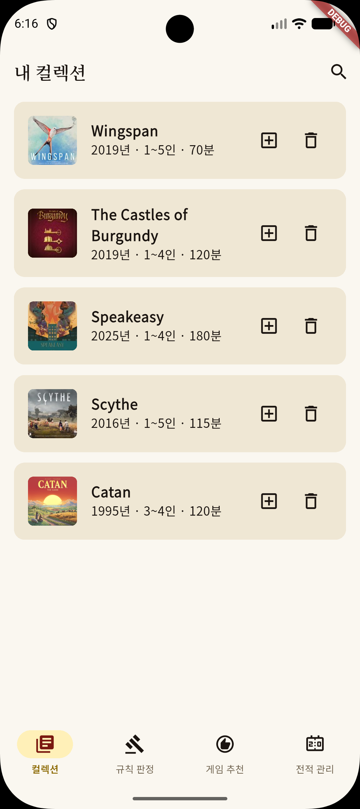
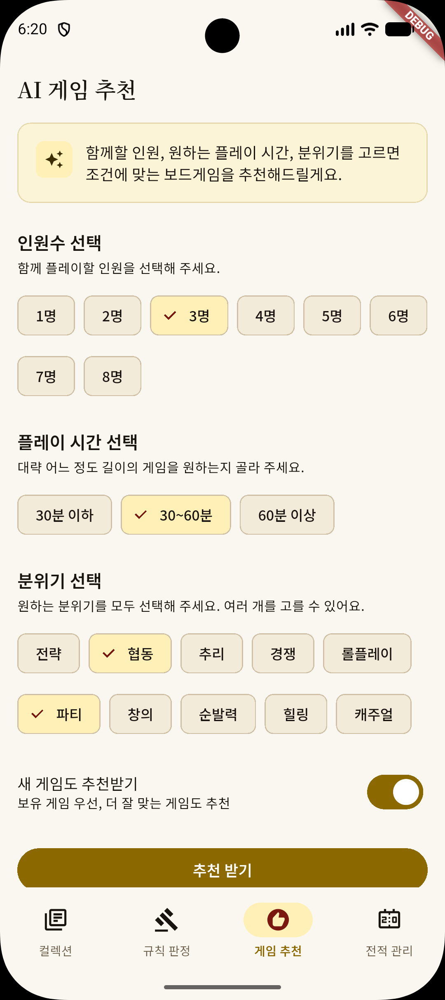

# BGMate
\




A new Flutter project.

## BGG API Token

`BggApiService` reads the BGG auth token from `BGG_API_TOKEN`, and this
project provides a wrapper script so every Flutter command can reuse the same
local env file.

Copy `dart_define.json.example` to `dart_define.json` in the project root and fill in your values (the file is Git-ignored):

```bash
cp dart_define.json.example dart_define.json
```

```json
{
  "BGG_API_TOKEN": "your_token_here",
  "GEMINI_API_KEY": "your_key_here"
}
```

Then run Flutter through the helper script:

```bash
./tool/flutter_with_env.sh run
./tool/flutter_with_env.sh test
./tool/flutter_with_env.sh build apk
```

The script automatically adds `--dart-define-from-file=dart_define.json` when the
file exists, so the same setup works for Android, iOS, macOS, web, and tests.

If you need to call Flutter directly, you can still pass the file yourself:

```bash
flutter test --dart-define-from-file=dart_define.json
```

## Getting Started

This project is a starting point for a Flutter application.

A few resources to get you started if this is your first Flutter project:

- [Learn Flutter](https://docs.flutter.dev/get-started/learn-flutter)
- [Write your first Flutter app](https://docs.flutter.dev/get-started/codelab)
- [Flutter learning resources](https://docs.flutter.dev/reference/learning-resources)

For help getting started with Flutter development, view the
[online documentation](https://docs.flutter.dev/), which offers tutorials,
samples, guidance on mobile development, and a full API reference.
